# 🛡️ Oculus 2.0: The AI-Powered Guardian of the Web

<div align="center">


**Detects Zero-Day Phishing Attacks in < 500ms.**
*Protection that thinks faster than hackers can type.*

[Features](#-key-features) • [Reporting](#-reporting--incidence-response) • [Installation](#-installation--setup) • [Architecture](#-architecture-visualization) • [Demo](#-how-to-test-demo-scenarios)

</div>

---

## ⚔️ Why Oculus?

Traditional antiviruses are **Reactive** (waiting for blacklists). Oculus is **Proactive** and **Educational**.

| Feature | 🚫 Traditional Antivirus | 🛡️ Oculus 2.0 |
| :--- | :--- | :--- |
| **Detection logic** | Static Blacklists (Slow) | **Real-Time Visual DNA & AI** (Instant) |
| **Zero-Day Defense** | Fails on new sites | **Detects threat patterns** automatically |
| **Visual Analysis** | None | **Chameleon 4.0** (Checks Logos/Colors) |
| **AI Brain** | Cloud-only or minimal | **Hybrid** (Local Bayes + Gemini 1.5 Flash / Groq) |
| **Community Trust** | None | **Crowdsourced Reputation & Voting** |
| **Education** | Blocked (Black Box) | **Explains *Why* it was banned** (AI Analysis) |
| **Protection Depth** | URL Only | **DOM, Text, Metadata, Scripts, & extensions** |

---

## 🏗️ Architecture Visualization

Detailed breakdown of the system's logic flow, cloud infrastructure, and user progression layers.

<details open>
<summary><b>🧠 1. Core Threat Detection Logic</b></summary>
<br>

How Oculus decides if a page is safe or malicious in milliseconds.

```mermaid
graph TD
    Start[Page Loaded] -->|1. Extract Features| DOM[DOM & Content Analysis]
    
    subgraph "Client-Side Engines (Local)"
        DOM -->|Visual DNA Match| Chameleon[🦎 Chameleon Engine 4.0]
        DOM -->|Text Tokens| NaiveBayes[🧠 Client Naive Bayes]
        DOM -->|Heuristics| RiskEngine[⚙️ Risk Engine]
        
        RiskEngine -->|Check| Entropy[Entropy Sentinel]
        RiskEngine -->|Check| Typosquat[Typosquat Detector]
        RiskEngine -->|Check| Punycode[IDN/Punycode Check]
    end
    
    Chameleon -->|Score| Aggregator{Risk Score > 50?}
    NaiveBayes -->|Score| Aggregator
    RiskEngine -->|Score| Aggregator
    
    Aggregator -- NO --> Safe[🟢 SAFE / CAUTION]
    Aggregator -- YES --> CloudCheck{Cloud Verification?}
    
    CloudCheck -->|API Call| CloudAI[☁️ Cloud AI Layer]
    CloudAI -->|Verdict| Block[🔴 BLOCK & EXPLAIN]
```


</details>

<details>
<summary><b>☁️ 2. AI Intelligence Cloud Layer</b></summary>
<br>

The serverless brain that models complex threats and orchestrates external APIs.


</details>

<details>
<summary><b>🎮 3. Gamification & Progression Layer</b></summary>
<br>

The feedback loop that rewards users for contributing to security.

```mermaid
graph LR
    UserAction[User Browsing / Reporting] -->|Triggers| XP_Service[XP Service Worker]
    
    subgraph "Progression Logic"
        XP_Service -->|Add XP| LocalStore[(Local Storage)]
        XP_Service -->|Sync| Server[Global Leaderboard]
        LocalStore -->|formula: sqrt XP/100| LevelCalc[Level Calculator]
    end
    
    LevelCalc -->|Level Up!| UnlockSystem{Feature Unlocks}
    
    UnlockSystem -->|Lvl 5| QR[📸 QR Scanner Unlocked]
    UnlockSystem -->|Lvl 10| ML[🧠 ML Heuristics Unlocked]
    UnlockSystem -->|Lvl 20| Cham[🦎 Chameleon Mode Unlocked]
    
    UnlockSystem -->|Notification| Notify[User Alert: New Level!]
```


</details>

---

## 🚀 Key Features

### 1. 🦎 Chameleon Engine 4.0 (`chameleon.js`)
Our proprietary **Visual DNA Detection** system.
*   **Visual Fingerprinting**: Instead of checking URLs, Chameleon looks at the *page itself*.
*   **200+ Brand Signatures**: Instantly recognizes clones of PayPal, Google, Binance, Chase, and more by analyzing:
    *   **Logos**: Detects brand logos in `` tags or CSS using fuzzy matching.
    *   **Color Palettes**: Matches dominant brand colors (e.g., Facebook Blue `#4267B2`, Spotify Green `#1DB954`).
    *   **Keywords**: Context-aware keyword matching ("Sign in", "Password", "Verify").
*   **Logic**: If a page *looks* like PayPal (High DNA Match) but is hosted on `secure-login-update.com` (Mismatch), Chameleon triggers a **CRITICAL** alert.

### 2. ⚙️ Advanced Risk Engine (`risk_engine.js`)
The core brain that aggregates scores from multiple heuristics:
*   **Entropy Sentinel**: Detects DGA (Domain Generation Algorithm) domains like `xy-123-abc-bank.com` by calculating character randomness.
*   **Typosquatting Detector**: Uses Levenshtein Distance to find domains close to popular brands (e.g., `g00gle.com` or `faceb00k.com`).
*   **Punycode & IDN Spoofing**: Detects `xn--` domains or "Homograph Attacks" where Cyrillic/Greek characters mimic Latin letters (e.g. `а` vs `a`).
*   **MITM / SSL Stripping**: Detects sensitive login forms served over insecure **HTTP**.
*   **Mixed Content Warning**: Flags secure HTTPS pages that load insecure scripts or images.
*   **Domain Coherence (Adaptive Whitelist)**: Grants a "Trust Bonus" if the Page Title perfectly matches the Domain Name (e.g., Title: "Small Bank" matches `smallbank.com`).

### 3. 🤝 Community Trust Manager (`admin.html`)
A global reputation system where the community defends itself.
*   **Global Synchronization**: Reputation scores are synced across all users and admins via the Cloud API.
*   **Admin Dashboard**:
    *   **Graphs**: Weekly Threat Analytics (resets every Monday).
    *   **Memory Restore**: Admin can restore lost server reports from the browser's local cache.
    *   **Consensus Logic**: Domains with a high "Unsafe" vote ratio are automatically flagged.
*   **Offline Queue**: If the server is down, reports are queued locally and synced automatically via Chrome Alarms.

### 4. 🚨 Reporting & Incident Response
How the community keeps the ecosystem clean.
*   **1-Click Reporting**: Right-click anywhere -> **"Report to PhishingShield"**.
*   **XP Rewards**: Earn **+10 XP** instantly for contributing.
*   **Report Lifecycle**:
    1.  **Submission**: User report enters Pending queue.
    2.  **Verify**: Backend AI scans/verifies the threat.
    3.  **Action**: Admin Bans (Syncs globally) or Ignores.
    4.  **Feedback Loop**: User is notified of the outcome ("Confirmed Phishing" or "False Positive").

### 5. 🌍 Global Threat Intelligence & VirusTotal
*   **VirusTotal Integration**: Downloads and URLs are checked against **VirusTotal’s API** for immediate reputation status (`/api/antivirus/scan`).
*   **Real-Time Bans**: Admin bans propagate to **all users instantly**.

### 6. 🧠 Hybrid Neuro-Symbolic AI
*   **Tier 1 (Client)**: **Naive Bayes** (`ai_model.js`) scans text for urgency/financial triggers locally. (0ms latency, privacy-first).
*   **Tier 2 (Cloud)**: **Gemini 1.5 Flash / Groq** analyze high-risk pages for deep context ("Imitating Amazon Login").

### 7. 🛡️ The Risk HUD & Defense Layers
*   **The Risk HUD**: 🟢 Safe (0-20), 🟡 Caution (21-50), 🟠 Dangerous (51-79), 🔴 Critical (80+).
*   **Fortress Mode**: Panic button to **BLOCK ALL 3rd-party scripts**.
*   **Rogue Extensions**: Warns about unknown extensions injecting code.
*   **Quishing Scanner**: Decodes and checks QR codes for malicious links.

### 8. 🎮 Gamification & XP System
*   **Leveling**: `Level = sqrt(XP / 100) + 1`.
*   **Unlocks**:
    *   **Level 5**: QR Scanner.
    *   **Level 10**: ML Heuristics.
    *   **Level 20**: Chameleon Mode.
*   **Penalties**: Lose XP for visiting banned sites.

---

## 🛠️ Installation & Setup

### 📋 1. Preparation Checklist
Before you begin, ensure you have the following installed:
*   [Node.js (LTS Version)](https://nodejs.org/) - Required for the backend API.
*   [Git](https://git-scm.com/) - To clone the repository.
*   [Google Chrome](https://www.google.com/chrome/) or any Chromium browser (Brave, Edge).
*   [VS Code](https://code.visualstudio.com/) - Recommended for editing code.

### 🔑 2. Get Your API Keys
Oculus relies on powerful AI engines. You need valid keys for them to work.

| Service | Why needed? | Cost | Get it here |
| :--- | :--- | :--- | :--- |
| **Google Gemini API** | Main forensic AI analysis | **Free** | [Google AI Studio](https://aistudio.google.com/) |
| **Groq Cloud** | Fast Llama-3 inference | **Free** | [Groq Console](https://console.groq.com/) |
| **VirusTotal API** | URL & File reputation | **Free** | [VirusTotal API](https://www.virustotal.com/) |
| **MongoDB Atlas** | Database for Users/Trust | **Free** | [MongoDB Atlas](https://www.mongodb.com/atlas) |

### 🖥️ 3. Backend API Setup
The backend is **already deployed on Vercel** (Serverless) for global availability, but you can run a **local instance** for testing and development.


```bash
# 1. Clone the repository
git clone https://github.com/subratkumarpadhy4/Oculus.git
cd Oculus/api

# 2. Install dependencies
npm install

# 3. Create your Environment file
# Create a file named '.env' in the 'api' folder and paste your keys:
GEMINI_API_KEY=YOUR_GEMINI_KEY_HERE
GROQ_API_KEY=YOUR_GROQ_KEY_HERE
VIRUSTOTAL_API_KEY=YOUR_VT_KEY_HERE
MONGODB_URI=mongodb+srv://<user>:<password>@cluster.mongodb.net/?retryWrites=true&w=majority
JWT_SECRET=super_secret_key_123

# 4. Start the Server
node index.js
# You should see: "Server running on port 3000"
```

### 🧩 4. Extension Setup
Load the "Brain" of Oculus into your browser.

1.  Open Chrome and navigate to `chrome://extensions`.
2.  **Enable Developer Mode** (Toggle switch in the top right corner).
3.  Click the **Load unpacked** button (Top left).
4.  Select the **Oculus** project folder (The root folder containing `manifest.json`).
5.  ✅ **Done!** The Oculus shield icon should appear in your toolbar.

> **⚠️ NOTE: Localhost vs Production**
> By default, the extension is configured to talk to `http://localhost:3000`.
> If you deploy the API to Vercel/Render, you must search & replace `http://localhost:3000` with your new URL in `js/background.js`, `js/auth.js`, and `js/dashboard.js`.

### 🔧 Troubleshooting

| Issue | Solution |
| :--- | :--- |
| **"Server Connection Failed"** | Ensure `node index.js` is running in your terminal. |
| **"MongoTimeoutError"** | Check your MongoDB Atlas **Network Access** settings. Whitelist IP `0.0.0.0/0` for testing. |
| **"AI Scan Error"** | Verify your `GEMINI_API_KEY` in `.env`. Ensure you have credits/quota. |
| **"Extension Error"** | Click "Errors" on the extension card in `chrome://extensions` to see logs. |

---

## 🧪 How to Test (Demo Scenarios)

### Scenario A: The AI Phishing Test
1.  Navigate to local file `tests/ai_phishing_test.html`.
2.  **Watch HUD**: Yellow (Heuristic) -> **Red (AI Confirmed)** after 2s.
3.  **Result**: "🤖 AI Analysis Detected Threat".

### Scenario B: Chameleon Clone Detection
1.  Open `tests/fake_instagram.html` (or create a file with Instagram colors and "Log in").
2.  **Observation**: Chameleon detects "Instagram Visual DNA" on a non-meta domain.
3.  **Result**: "🦎 DNA MISMATCH! Page is Instagram clone".

---

## 📂 Project Structure

*   **/js**
    *   `chameleon.js`: Visual DNA analysis engine.
    *   `risk_engine.js`: Core heuristic logic (Entropy, Typosquat, Brand).
    *   `ai_model.js`: Client-side Naive Bayes classifier.
    *   `content.js`: UI orchestration & DOM scanner.
    *   `background.js`: Service worker, Offline Sync, Fortress Mode rules.
*   **/api**: Backend Serverless Functions (Express/Vercel).
    *   `index.js`: Main API entry point (AI, Trust, Users).
*   **/tests**: Safe environments for testing malware logic.

---

## 📄 License
MIT License. Open Source for Educational and Security Research.

<div align="center">
<b>Built with ❤️ by the Oculus Team</b>
</div>
