# 🛡️ PhishingShield 2.0: The AI-Powered Guardian of the Web

<div align="center">


**Detects Zero-Day Phishing Attacks in < 500ms.**
*Protection that thinks faster than hackers can type.*

[Features](#-key-features) • [Installation](#-installation--setup) • [Architecture](#-architecture-visualization) • [Live Demo](#-how-to-test-demo-scenarios)

</div>

---

## ⚔️ Why PhishingShield?

Traditional antiviruses are **Reactive** (waiting for blacklists). PhishingShield is **Proactive**.

| Feature | 🚫 Traditional Antivirus | 🛡️ PhishingShield 2.0 |
| :--- | :--- | :--- |
| **Detection logic** | Static Blacklists (Slow) | **Real-Time AI & Heuristics** (Instant) |
| **Zero-Day Defense** | Fails on new sites | **Detects threat patterns** automatically |
| **User Feedback** | Passive / Non-existent | **Community Trust Scores** & Voting |
| **Education** | "Access Denied" (No Info) | **Explains WHY** (e.g., "Typosquatting detected") |
| **Sync Speed** | Hours/Days | **< 10 Seconds** (Global Neural Sync) |
| **AI Brain** | None / Cloud-heavy | **Hybrid** (Local Heuristics + Groq/Gemini LLM) |

---

## 🏗️ Architecture Visualization

### 🌐 System Architecture & Logic
#### 1. 🧩 Modular System View
The system is composed of specialized detectors that feed into a central Risk Engine.


<details>
<summary><b>🔍 Click here to view Interactive Diagram (Mermaid)</b></summary>
<br>


</details>

#### 2. ⚡ Threat Detection Logic Flow
How a "Suspicious Site" triggers the AI Defense Grid.


<details>
<summary><b>🔍 Click here to view Interactive Diagram (Mermaid)</b></summary>
<br>


</details>

---

## 🚀 Key Features

### 1. 🔍 Intelligent Risk Engine (`risk_engine.js`)
The core of our defense is a purely client-side heuristic engine.
*   **Brand Impersonation**: Compares page content/titles against a protected list of major brands (PayPal, Google, SBI, etc.).
*   **Typosquatting Sentinel**: Detects deceptive domains like `goog1e.com` or `paypaI.com`.
*   **Punycode & Homograph Detection**: Blocks IDN homograph attacks (e.g., Cyrillic 'a' vs Latin 'a').
*   **Entropy Analysis**: Identifies randomly generated domains (DGA) used by botnets.
*   **Extension Audit**: Scans *other* installed extensions to detect rogue scripts.

### 2. Dual-Engine AI Analysis
When heuristics flag a site as suspicious, the **AI Cloud Layer** engages.

#### AI Logic Flow

```mermaid
graph LR
    A["Suspicious Page"] --> B{"Heuristic Score > 20?"}
    B -- No --> C["Green HUD"]
    B -- Yes --> D["Snapshot DOM"]
    D --> E["Send to Groq Llama-3"]
    E --> F{"Is Phishing?"}
    F -- No --> G["Mark Safe (Cache)"]
    F -- Yes --> H{"Confidence > 80%?"}
    H -- Yes --> I["🔴 BLOCK & ALERT"]
    H -- No --> J["Consult Gemini (Fallback)"]
    J --> I
```


*   **Results**: Generates a human-readable report (e.g., "AI Detected: Imitating Amazon Login page with urgency tactics").

### 3. 🛡️ The Risk HUD (Head-Up Display)
A non-intrusive overlay that sits on top of your browsing experience.

#### 📊 Threat Matrix
| Risk Level | Score | Color | Meaning | Action |
| :--- | :---: | :---: | :--- | :--- |
| **SAFE** | **0 - 20** | 🟢 Green | Verified Brand | Safe to process. |
| **CAUTION** | **21 - 50** | 🟡 Yellow | Suspicious traits | **Proceed with care.** |
| **DANGEROUS** | **51 - 79** | 🟠 Orange | High Heuristic Risk | **Leave Immediately.** |
| **CRITICAL** | **80 - 100** | 🔴 Red | **AI Confirmed Threat** | **BLOCKED.** |

### 4. 🌐 Real-Time Global Synchronization
*   **Community Trust**: Sites have dynamic trust scores based on user votes.
*   **Global Ban System**: Admin bans propagate to **all users in < 10 seconds**.
*   **Hybrid Sync**: Merges Local Server (DEV) and Global Cloud data seamlessly.

### 5. 🎮 Gamification & XP System
Security meets Fun.
*   **Earn XP**: +10 XP for Reports, +5 XP for safe browsing.
*   **Ranks**: Novice 🥉 -> Scout 🥈 -> Sentinel 🥇 -> Cyber Ninja 🥷.
*   **Unlocks**: High-level features (like ML Analysis) unlock as you level up.

### 6. 🚨 Report, Ban, & Unban Lifecycle
*   **Report**: Right-click -> "Report to PhishingShield".
*   **Ban**: Admins review and ban sites instantly.
*   **Block**: Uses `declarativeNetRequest` for network-level blocking.

### 7. 🛡️ Advanced Download Protection
PhishingShield analyzes incoming files for hidden execution risks:
*   **Double Extension Detection**: Blocks `invoice.pdf.exe`.
*   **Source Correlation**: Downloads from "High Risk" sites are flagged automatically.
*   **Fortress Mode**: Lockdown mode handling 3rd party scripts.

### 8. 📸 AI Quishing (QR Phishing) Detector
Phishing schemes now use QR codes to bypass text filters. We catch them.
*   **Auto-Scan**: Scans visible images for valid QR codes.
*   **URL Extraction**: Decodes the QR payload securely in the background.
*   **Risk Analysis**: Runs the decoded URL through the same Risk Engine & AI checks as a normal page visit.
*   **Overlay Alert**: Draws a warning box directly over the malicious QR code image.

---

## 🛠️ Installation & Setup

### Prerequisites
*   Node.js (v16+)
*   Chrome / Edge / Brave

### 1. Server Setup
```bash
git clone https://github.com/subratkumarpadhy4/PhishingShield.git
cd PhishingShield/server
npm install

# Setup API Keys
echo "GROQ_API_KEY=your_key" >> .env
echo "GEMINI_API_KEY=your_key" >> .env

npm start
```

### 2. Extension Setup
1.  Go to `chrome://extensions`.
2.  Enable **Developer Mode**.
3.  Click **Load Unpacked**.
4.  Select the `PhishingShield-2.0` folder.

---

## 🧪 How to Test (Demo Scenarios)

### Scenario A: The AI Phishing Test
1.  Navigate to local file `tests/ai_phishing_test.html`.
2.  **Watch HUD**: Yellow (Heuristic) -> **Red (AI Confirmed)** after 2s.
3.  **Result**: "🤖 AI Analysis Detected Threat".

### Scenario B: Typosquatting
1.  Open `tests/fake_instagram.html`.
2.  **Observation**: HUD detects "Brand Impersonation" & "Unencrypted Login".

### Scenario C: QR Quishing
1.  Open `tests/qr_safe.html`.
2.  **Observation**: Engine scans QR codes in images and validates the destination URL.

---

## 📂 Project Structure

*   **/js**
    *   `risk_engine.js`: Pure mathematical models for risk calculation.
    *   `content.js`: UI orchestration.
    *   `background.js`: Service worker for sync & API.
*   **/server**: Express app handling AI & Consistency.
*   **/tests**: Safe environments for testing malware logic.

---

## 🔒 Permissions Policy

| Permission | Justification |
| :--- | :--- |
| `activeTab` | Required to read DOM for heuristic analysis. |
| `scripting` | Needed to inject the Risk HUD overlay. |
| `declarativeNetRequest` | Used to block banned sites at the network layer. |
| `storage` | Stores User XP, Level, and cached threats. |

---

## 📄 License
MIT License. Open Source for Educational and Security Research.

<div align="center">
<b>Built with ❤️ by the PhishingShield Team</b>
</div>
